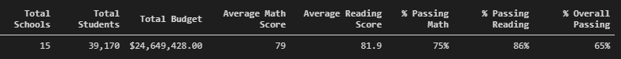
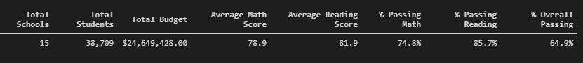
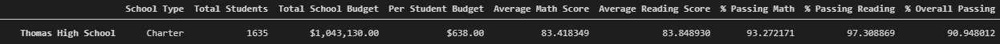
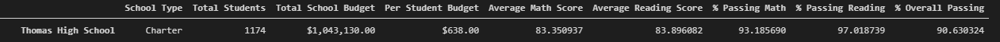
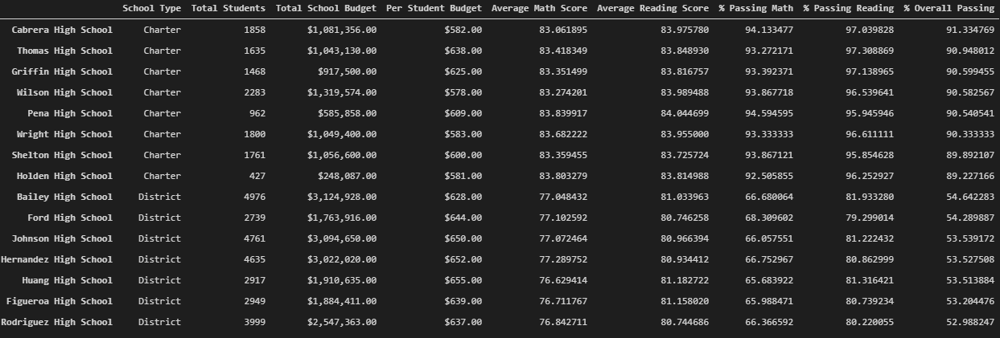
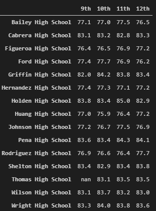
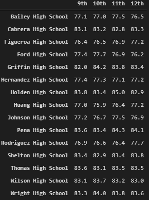

# School District Analysis
Analysis using ipython notebooks to clean, manipulate, and summarize data relating to student performance across 15 schools in the "PyCity" school district.

## Overview
The purpose of this analysis is to provide statistics to district executives to improve understanding of how average student performance relates to funding, school size, and school type. In addition to these summaries, some cleanup of the data is performed to allow for more accurate and convenient future analysis. Below I will discuss the changes to the data seen after removing the math and reading scores for 9th grade students at Thomas High School, and whether that data's removal from the summary statistics suggests that academic dishonesty is involved. I will refer to the 9th grade Thomas High School student records as "the suspect data" for the purpose of this discussion.

## Results
* How is the district summary affected?
    Here's the district summary including the suspect data (complete):
    
    

    And here's the revised district summary, with the suspect data removed:

    

    At the district level, there is not much impact on the summary statistics from removing the suspect data. This is as expected, as we've only removed ~1% of the data (so the data being summarized is ~99% the same).

*  How is the school summary affected?
    Here's the per-school summary including the suspect data (complete):

    

    And here's the revised district summary, with the suspect data removed:

    

    At the school level, we might expect to see a larger affect on the summary statistics after removing the suspect data (~28% of all Thomas HS students). However, the impace of removing the suspect data is not very pronounced: average math and reading scores are minutely lowered, as are the % passing stats. The summary is virtually unchanged.

* How does replacing the suspect data with NaN affect Thomas HS performance relative to other schools?
    As shown above, the summary statistics have not shifted very much - across the board, we've observed a negative change in average scores of less than 1 percentage point.

    Here's the per-school summaries including the suspect data, ranked by % overall passing:

    

    Sorted by % overall passing, Thomas HS is still only 2nd to Cabrera after removing the suspect data (new % overall passing is 90.63, still higher than #3, Griffin's 90.60). The average math and reading scores are also still fairly consistent with those of the higher-ranking passing % schools.

* How does replacing the suspect data with NaN affect other summaries?
    * Effect on Scores by Grade Summaries
        As expected, replacing only the Thomas HS 9th grade values only affects this summary at the intersection of those two indices. Here's the output from the revised data (math scores):

        

        We can sanity check this against the original per-grade score breakdown:

        

    * Effect on Scores by School Spending Summaries
        As noted before, the change in average scores or passing %'s is fairly minute after removing the suspect data. Because we're not attempting to scale the $/student calculation based on the revised Thomas student count, we can expect the summaries of the relevant spending group ("$630-644") to remain largely unchanged as well.

        Here's the original summary of scores grouped by per-student spending for that group, will all data:
        
        

        And here's the summary of scores grouped by per-student spending for that group, with the revised data:

        

        As expected, the results are virtually identical.

    * Effect on School Size Summaries
        Thomas HS is one of the top schools by % overall passing (even after NaN'ing suspect data) so whenever it is grouped with other schools, it tends to bring that average up. Because removing the suspect data lowers that value a smidge, its "size" group summary statistics also fall slightly:

        Here's the original summary of Medium size schools scores (including all data):

        

        And here's the revised summary of Medium size schools after removing Thomas HS 9th grade:

        

    * Effect on School Type Summaries
        Again, the impact of removing the suspect data becomes harder to see when Thomas HS is grouped with other schools for summaries. In the case of Type ("Charter") this impact could be fairly called negligible in this analyst's opinion, skewing the results by less than a hundredth of a percent:

        Here's the original summary by school type, including all data:

        

        And here's the revised summary by school type, after removing Thomas HS 9th grade:

        

## Summary
